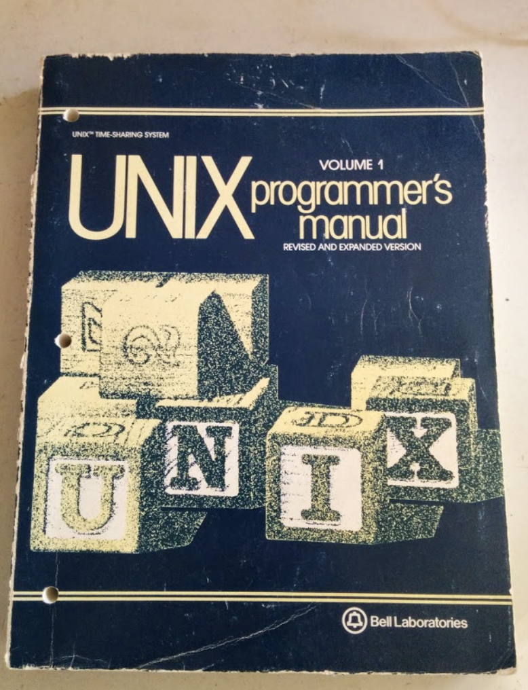
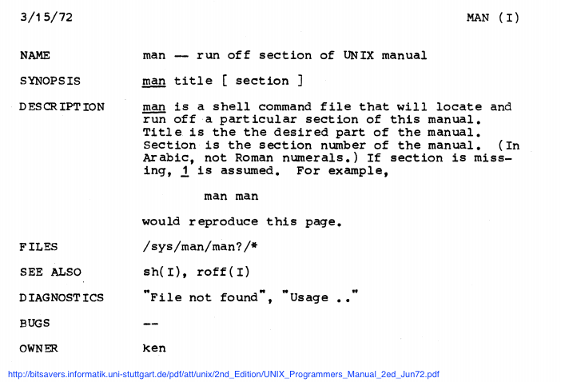
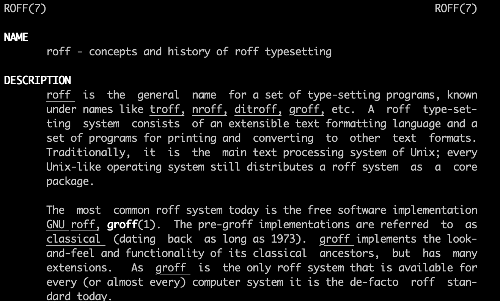
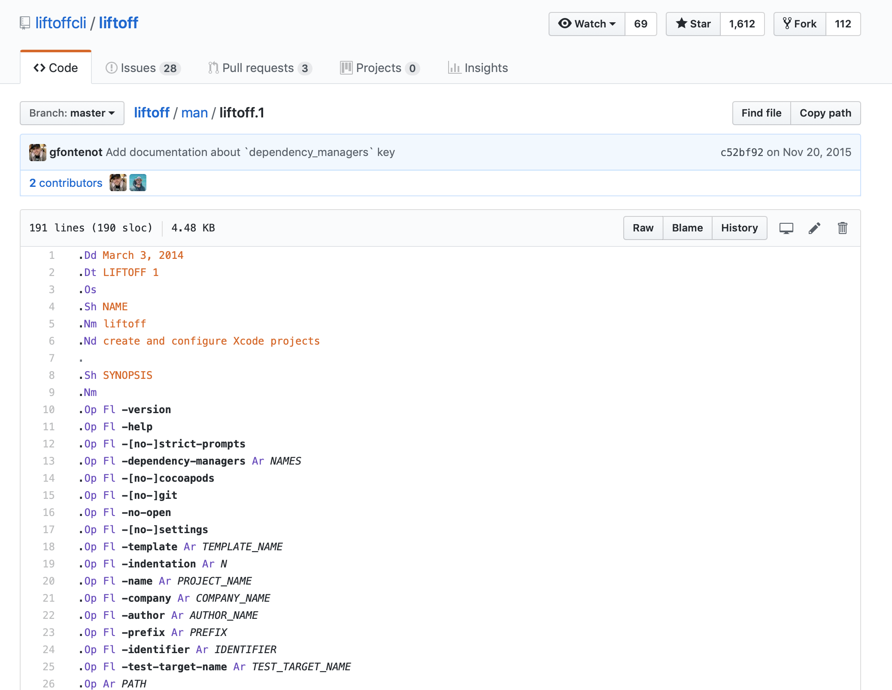
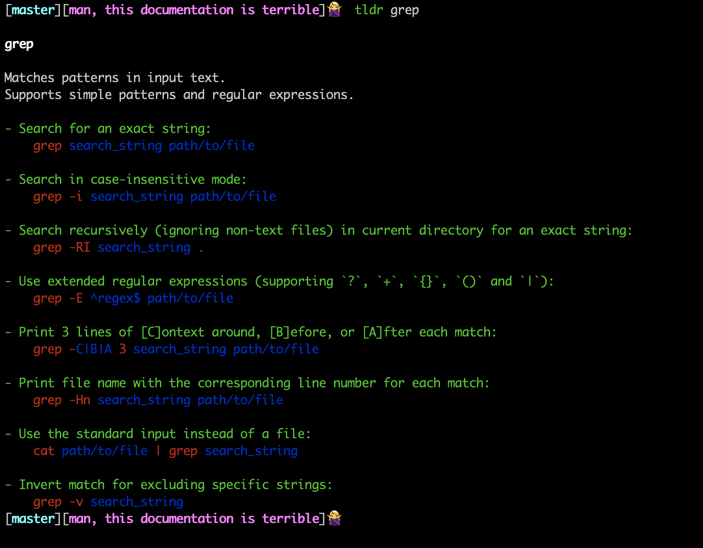

# "`man`, This Documentation is Terrible!"

## By Adarsh Pandit
### @adarshp (Twitter)
### @adarsh (GitHub)

^ Hi! I'm Adarsh and I'm a Ruby developer and consultant. I run Cylinder Digital, a consulting company where we build and design custom software products to solve business problems.
Today I'm going to talk about man pages (man).


---

# History of UNIX

* The documentation was released as "The Unix Programmer's Manual", which consisted of pages collected together in a single three-hole binder.


^ In the first two years of the history of Unix, no documentation existed.
The first actual man pages were written by Dennis Ritchie and Ken Thompson at the insistence of their manager Doug McIlroy in 1971. ON PAPER.


---
# The First Man



* The manual documented only 61 different commands, along with a couple dozen system calls and a few library routines.

^ Though the man command itself was not to come until later, the first edition of the Unix Programmer’s Manual established many of the conventions that man pages adhere to today, even in the absence of an official specification.
The documentation for each command included the well-known NAME, SYNOPSIS, DESCRIPTION, and SEE ALSO headings.


---
# man pages are a reference, not a tutorial


> > "`man` pages may not be much use for the former, but they are perfect for the latter." -Doug McIlroy


^ Doug McIlroy highlighted the sometimes-overlooked distinction between tutorial and reference;

---


# In June 1972, the second edition of the manual was printed

^ In it, they added the `man` command, and of course, because they are smartasses, added `man man`.


---


---

# Why does it look this way?

## roff



^ Ken and Dennis thought of `man` as a way to "run off one section of the
manual"
* The term “run off” referred to the physical act of printing a document but also to the program they used to typeset documents, roff.
* The roff program had been used to typeset both the first and second editions of the Unix Programmer’s Manual before they were printed, but it was now also used by man to process man pages before they were displayed.
* The man pages themselves were stored on every Unix system in a file format meant to be read by roff.
* This was basically an early LaTeX and for whatever reason, is still in use
today.
* We get around this by using Pandoc or Kramdown to translate Markdown into this
obscure format.

---


### roff: a terrible example



^ Here's an example from a friend's repo. To write something that responds to
`man command name`, you have to use this crazy markup.


---

### roff: see for yourself

Take a look on your own machine by using the `--path` argument to man:

```
$ less `man tar --path`
```
---

# TLDR : It's Examples, this is what we wanted in the first place




---
# um - notes for yourself.


(Demo time)

```
$ um help
$ um edit grep
$ um grep
$ um list
$ um topics
```

---
# um - you can get crazy

```
# grep -- Print lines matching a pattern

{:data-section="shell"}
{:data-date="September 26, 2017"}
{:data-extra="Um Pages"}
{::comment}
^ The Kramdown "attribute list" which provides metadata for the page.
The first heading must include the name of the command and a summary.
{:/}

## SYNOPSIS
{::comment}Top level Markdown headings become man section headings.{:/}
**grep** [OPTIONS...] *pattern* [FILE...]

## REGEX SYNTAX
{::comment}Here we're using a "definition list" to get that man page look.{:/}

`.`
: Matches any character.

```

---
# Even More Alternatives

* Cheat: https://github.com/chrisallenlane/cheat
* eg: https://github.com/srsudar/eg
* Bro: https://github.com/hubsmoke/bro, can vote up/down

---
# THANKS!

1. Pax / Amanda
2. Gabe
3. Viewers like you

### Bibliography
```
* https://twobithistory.org/2017/09/28/the-lineage-of-man.html
* https://truss.works/blog/2016/12/9/man-splained
```
